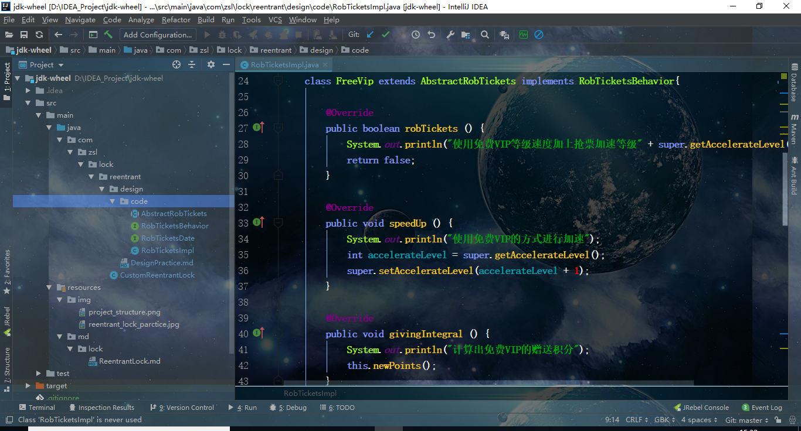

#### 一：项目目标

将JDK源码模块化整理，整理方向包括如下几方面：
1. 重实现模块功能附带源码注释
2. 设计思想运用场景示例
3. 整体实现结构精彩描述与面试常问问题解决

#### 一：关联博客地址

在很多方向上CSDN上博客的描述会更加详细，但是不如本项目具有层次结构，可以补充对照阅读
CSDN：https://blog.csdn.net/weixin_43495590 

#### 二：项目结构图

#### 三：项目结构描述

1. 每个大模块划分都是zsl包下的一个模块包，如项目结构图中Lock锁的lock包
2. 每个大模块包中都包含具体实现模块，如项目结构图中ReentrantLock的实现
3. 每个具体实现模块中都包含该具体模块的轮子制造如CustomReentrantLock类、设计思想运用实践如design_practice包
4. 每个具体实现模块都有一个位于resources/md包下的总结文档，如ReentrantLock的文档ReentrantLock.md