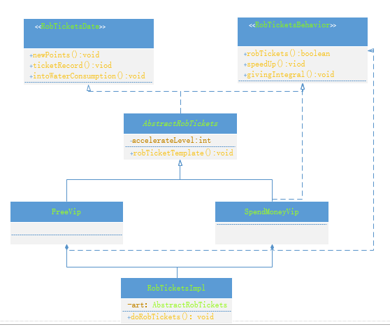

#### 一：主要思想
1. 模板方法设计模式为扩展提供简单实现可能
2. 基本方法使用内部类实现不同逻辑，直接屏蔽掉上层模块中底层模块实现细节

#### 二：实践场景
抢票软件的VIP角色有免费赠送VIP，花钱VIP。不同角色可以有不同的抢票速度、不同的加速效果、不同的积分赠送等
但是这些角色对于消费数据入库如支付流水、购票记录等操作又是一致的

#### 三：实现设计
1. 个人感觉喜欢考虑使用责任链的设计模式进行实现，但是责任链在链长不好控制的时候必定会带来性能的影响
2. 采用内部类实例解决也就是ReentrantLock对于公平实现的策略，这种方式可能会导致一个类代码的膨胀

#### 四：内部类实现UML图
